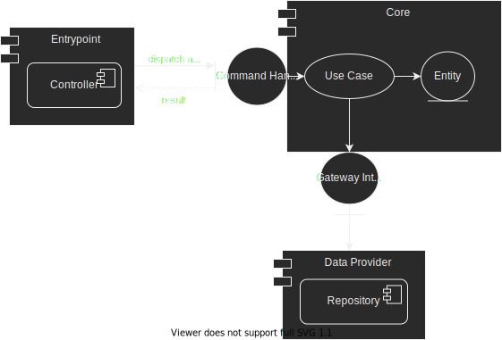

# Hello Pizza - API

This is a Kotlin project that is responsible for creating and maintaining a basic pizzeria routine.

- This project was not intended to be a commercial application, but just to practice some cool features.
- This project was inspired from a friend of mine project [_Authorizer_](https://github.com/DiegoRamalho/Authorizer).

## The MVP

With this API, I would like to create a full reactive api, in which I will create a chatbot and also an Angular app that consumes the resources and provides a full use of the pizzeria routine for a normal consumer and even to an administrator.  
The main objective is to create an "omnichannel API" that can be consumed by any application that wants to be integrated with this API.

## Project details

### Design

The project design is based on the [Clean Architecture](https://blog.cleancoder.com/uncle-bob/2012/08/13/the-clean-architecture.html), the [_SOLID_](https://web.archive.org/web/20150906155800/http://www.objectmentor.com/resources/articles/Principles_and_Patterns.pdf) principles and some [design patterns](https://refactoring.guru/design-patterns).

As you can see in the diagram above, the project was separated into the following layers:

* _**Entrypoint**_ Layer:
    * Responsible for communication with the user.
    * Processes the input entered, generates a command, calls the _**Core**_ layer and returns result to the user.

* _**Core**_ Layer:
    * Responsible for encapsulate and implement all the business rules into _use cases_ and _entities_ and it has no dependencies with other layers.
    * The _use cases_ orchestrate the flow of data to and from the _entities_, and direct those _entities_ to use their enterprise wide business rules to achieve the goals of the use case.
    * The _use cases_ combine data from 1 or multiple gateway interfaces, which are implemented in the _**Data Provider**_ layer.

* _**Data Provider**_ Layer:
    * Responsible to coordinate data from the different Data Sources.
    * Implements the Domain Gateway Interface and is in charge of combining 1 or multiple Repositories.

### Patterns

The project uses the [Command pattern](https://refactoring.guru/design-patterns/command) to simplify communication between entrypoint and core layers. That way, any new type of entrypoint or operation just needs to know how to create the related command. After that, just dispatch the command to the command handler. More details, see [SizeResultCommandUseCase](src/main/kotlin/br/com/hellopizza/api/core/usecase/pizza/SizeResultCommandUseCase.kt)

The project creates a chain with all validations rules related with each use case that changes the account state, using the [Chain of Responsibility pattern](https://refactoring.guru/design-patterns/chain-of-responsibility). More information at [ValidateRule](src/main/kotlin/br/com/hellopizza/api/core/usecase/pizza/rule/ValidateRule.kt).